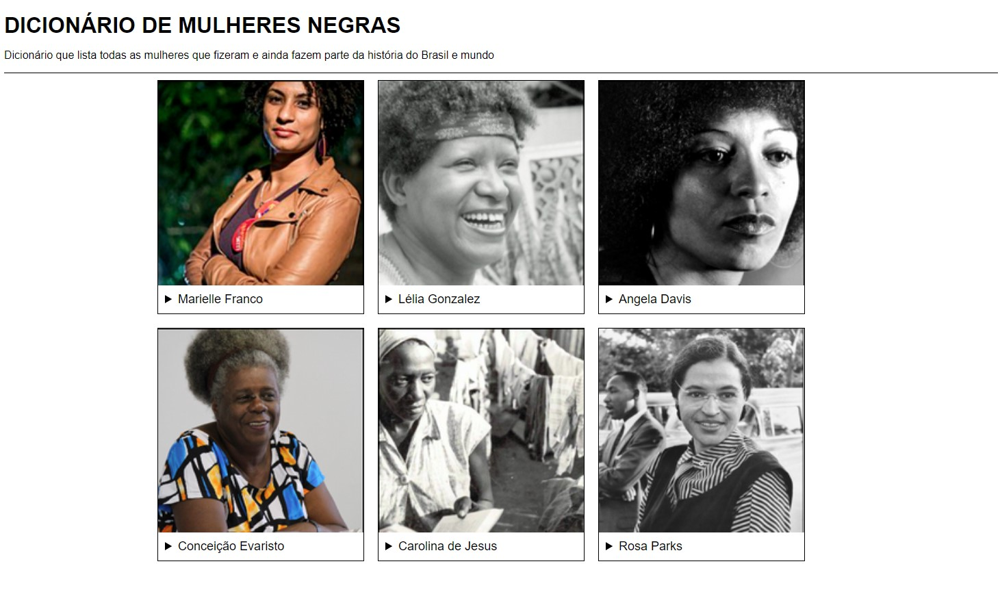
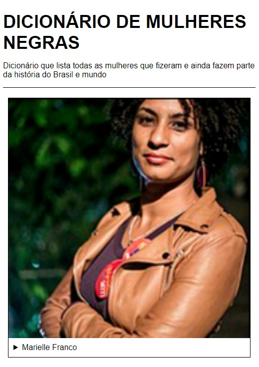

    

  <a href="#-tecnologias">Tecnologias</a>&nbsp;&nbsp;&nbsp;|&nbsp;&nbsp;&nbsp;
  <a href="#-projeto">Projeto</a>&nbsp;&nbsp;&nbsp;|&nbsp;&nbsp;&nbsp;
  <a href="#-layout">Layout</a>&nbsp;&nbsp;&nbsp;|&nbsp;&nbsp;&nbsp;
  <a href="#memo-licença">Licença</a>

# [Curso Online Eu ProgrAmo](https://euprogramo.thinkific.com/enrollments) | FE2 (Front End 2)  
Turma 04  

## 🚀 Tecnologias

Esse projeto foi desenvolvido com as seguintes tecnologias:

- HTML e CSS
- JavaScript
- Git e Github

## 💻 Projeto

Página de um Dicionário que lista todas as mulheres que fizeram e ainda fazem parte da história do Brasil e mundo.

## 🔖 Layout

Você pode visualizar o [layout do projeto online](https://mulheresnegras.vercel.app/)  

 

Desktop: 

      

Mobile: 

      

## :memo: Licença

Esse projeto está sob a licença MIT.

---

Feito com ♥ by Patrícia vs Programaria :wave: 
